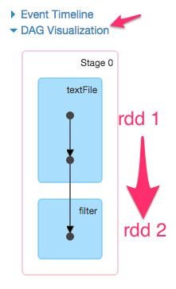
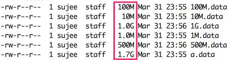
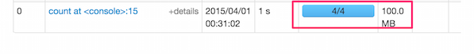

<link rel='stylesheet' href='../assets/css/main.css'/>

[<< back to main index](../README.md)

Lab: RDD Basics operations
================================

### Overview
* Learning basic operations like filter / map / count
* work with larger sized RDDs
* Load multiple files into a single RDD
* Save computed RDDs


### Depends On
None

### Run time
30-40 mins


## Step 1: Fire up Spark shell

```bash
    $   spark-shell
```

## Step 2: Load file

```scala
    val f = sc.textFile("/data/twinkle/sample.txt")
```

**=> what is the 'type' of f ?**  
Hint : just type `f` in the shell
Here is a possible output

```scala
    scala> f
    res0: org.apache.spark.rdd.RDD[String] = data/twinkle/sample.txt MappedRDD[3] at textFile 
```


## Step 3:  Filter
Let's find how many lines contain the word 'twinkle'
We will use the 'filter' function

```scala
    val filtered = f.filter(line => line.contains("twinkle"))
```


After entering the above in Spark-shell...  
**=> Goto Spark shell UI (port number 4040)**  
**=> Inspect the 'Stages' section in the UI.**  
**=> How is the filter executed? Can you explain the behavior?**  

**=> Count how many lines contain the word 'twinkle'**  
hint : apply `count()` to `filtered` variable

Here is a sample output

```console
    15/03/31 23:19:30 INFO DAGScheduler: Stage 0 (count at <console>:17) finished in 0.074 s
    15/03/31 23:19:30 INFO DAGScheduler: Job 0 finished: count at <console>:17, took 0.141676 s
    res1: Long = 2  <--- this is the result of count()
```


**=> Check the Stages in UI,  what do you see?**  
**=> How long did the job take?**  
**=> Print out all the lines containing the word 'twinkle'**   
Hint : `collect()`

Here is a sample output

```console
    res2: Array[String] = Array(twinkle twinkle little star, twinkle twinkle little star)
```


**=> Checkout 'DAG' visualization**



**=> Quit Spark-shell using 'exit'  or pressing  Control+D**


## STEP 4:  Large data sets
**==> Quit previous spark-shell session, if you haven't done so yet.. `Control + D`**  

We have some large data sets of 'twinkle' data generated in `/data/twinkle`  directory.




## Step 5:  Start shell with more memory

```bash
    $   spark-shell  --executor-memory 1G  --driver-memory 1G
```


## Step 6: Process a large file
**=> In Spark Shell, load `/data/twinkle/100M.data`**  

```scala
    val f = sc.textFile("/data/twinkle/100M.data")
```

**=> Count number of lines that have the word "diamond"**  
hint : `filter`  and `count`

```scala
    val filtered = f.filter (_.contains("diamond"))
```

**=> How many 'tasks' are used in the above calculation**  
hint : Check spark shell UI at port 4040



**=> Can you explain the number of tasks?**  
Hint : check number of partitions in RDD using `getNumPartitions`  or `partitions.length`  
```
    f.getNumPartitions
```


**=> Count number of lines that does NOT have the word 'diamond'**  
Hint : use negative operator  !  
`filter(line => ! line.contains("diamond")) `

**=> Verify both counts add up to the total line count**

**=> Notice the time taken for each operation**

**=> Try the above with larger data files : 500M.data  ... 1G.data**
  - note the times taken
  - how many tasks?


## Step 7: Loading multiple files
**=> Load all *.data files under  data/twinkle  directory**  

```scala
     val files = sc.textFile("/data/twinkle/*.data")
```

**=> Do a count() on RDD.**

Notice the partition count and time taken to execute
Verify partition count from Spark-Shell UI


-----------------------
STEP 6:  Saving the RDD
-----------------------
Continuing with the big RDD created on step (5)....

**=> Create a new RDD by filtering first RDD for word 'diamond'**  
```scala
    val filtered = files.filter(_.contains("diamond"))
```

**=> Save the new RDD into a directory**  

```scala
    filtered.saveAsTextFile("MY_NAME_out")  // fix MY_NAME
```

**=> Inspect the output directory using HDFS File browser **


## Bonus Lab: Merging partitions into a single one
When we saved data in the above section, there are multiple files created in output directory.   Can you just create one output file?   
Hint : see the API for `coalesce or repartition`