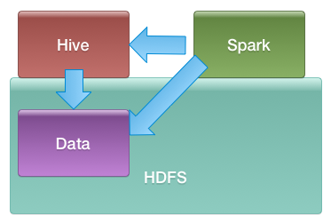

<link rel='stylesheet' href='../assets/css/main.css'/>

# Spark SQL on Hadoop




## Step 1 : Login to Hadoop node
Instructor will provide details


## Step 2 : Start Spark shell

```bash
    $    spark-shell
```

And set the log level to WARN
```scala
scala> 
            sc.setLogLevel("WARN")
```


## Step 3 : Load JSON into Dataframe
Issue the following commands in Spark-shell

```scala

    val clickstream = sqlContext.read.json("/data/clickstream/in-json/clickstream.json")

    // inspect the schema
    clickstream.printSchema

    // inspect data
    clickstream.show
```

Your output might looks like this:

``` console

    root
     |-- action: string (nullable = true)
     |-- campaign: string (nullable = true)
     |-- cost: long (nullable = true)
     |-- domain: string (nullable = true)
     |-- ip: string (nullable = true)
     |-- session: string (nullable = true)
     |-- timestamp: long (nullable = true)
     |-- user: string (nullable = true)
```


## Step 4 : Methods available on Dataframe
Use tab completion to explore methods available

```
    clickstream.  HIT THE TAB KEY
```


## Step 5 : Querying Dataframes

**Find records that have cost > 100**
```scala

    val over100 = clickstream.filter("cost > 100")
    over100.show

    // count the records
    over100.count
```

Your output may look like this:  

```console
+-------+-----------+----+-----------------+----+---------+-------------+------+
| action|   campaign|cost|           domain|  ip|  session|    timestamp|  user|
+-------+-----------+----+-----------------+----+---------+-------------+------+
|clicked|campaign_13| 101|       amazon.com|ip_6|session_7|1420329600000|user_2|
|clicked| campaign_4| 153|      twitter.com|ip_6|session_4|1420394400000|user_3|
| viewed|campaign_17| 154|sf.craigslist.org|ip_4|session_7|1420480800000|user_4|
+-------+-----------+----+-----------------+----+---------+-------------+------+

   
```

**Count records where action = 'clicked'**  
```scala

    // TODO: fill in ???
    clickstream.filter("action = '???'").count
```

Possible output

```console
+-------+-----------+----+-----------------+----+----------+-------------+------+
| action|   campaign|cost|           domain|  ip|   session|    timestamp|  user|
+-------+-----------+----+-----------------+----+----------+-------------+------+
|clicked|campaign_18|  46|     usatoday.com|ip_6|session_10|1420070400000|user_3|
|clicked|campaign_11|  51|     facebook.com|ip_3| session_5|1420092000000|user_2|
|clicked| campaign_4|  23|       flickr.com|ip_6|session_10|1420178400000|user_2|
|clicked|campaign_16|  46|       google.com|ip_3| session_3|1420221600000|user_2|
+-------+-----------+----+-----------------+----+----------+-------------+------+

```

**Count the number of visits from each domain**    
```scala
    clickstream.groupBy("domain").count.show
```

## Step 6 : Querying Using SQL

```scala

    //  register the data frame as a temporary table
    clickstream.registerTempTable("clickstream")

    // try sql queries
    sqlContext.sql("select * from clickstream").show

    // find all facebook traffic
    sqlContext.sql("select * from clickstream where domain = 'facebook.com'").show

    // count traffic per domain from highest to lowest
    sqlContext.sql("select domain, count(*) as total from clickstream  group by domain order by total desc").show

```


## Step 7 : Load all JSON data
Let's load all JSON files in `/data/domains/in-json` directory

```scala

    val clicks = sqlContext.read.json("/data/domains/in-json/")
    clicks.count

    clicks.groupBy("domain").count.show

    // repeat instructions from step 6
```


### STEP 8: Joining Datasets

**==> Load `domains` dataset and register it to table `domains`**  

```scala
    val domainsDF = sqlContext.read.json("/data/domains/in-json")
    domainsDF.show
    domainsDF.registerTempTable("domains")
```

**==> Join `clickstreams` and `domains`**    
Hint : Join query syntax for joining two tables A, B

```sql
    sqlContext.sql("select A.*, B.* from A  join B  ON (A.x = B.y)") 
```

**==> Count traffic per domain category (news, social ..etc)**    
Hint : query the joined datasets
