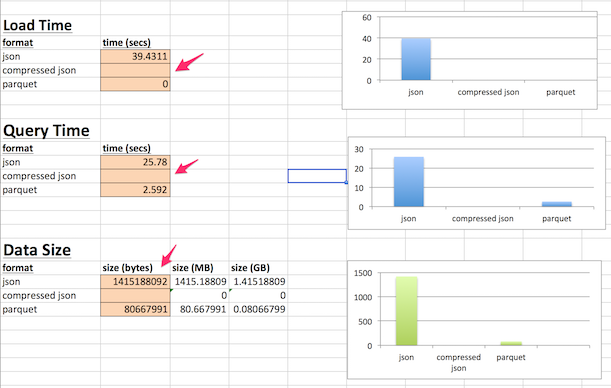

<link rel='stylesheet' href='../assets/css/main.css'/>

[<< back to main index](../README.md) 

Lab: Data formats (JSON vs. Parquet vs. ORC)
==========================================

### Overview
Comparing different data formats for Dataframes.  We will evaluate JSON, Parquet and ORC format.

Background reads:
- [Spark data frames](https://spark.apache.org/docs/latest/sql-programming-guide.html)
- JSON format 
    - [wikipedia](https://en.wikipedia.org/wiki/JSON)
    - [json.org](http://json.org/)
- Parquet format
    - [Parquet project](https://parquet.apache.org/)
    - [parquet github](https://github.com/Parquet/parquet-format)
    - [presentation](http://www.slideshare.net/larsgeorge/parquet-data-io-philadelphia-2013)
- ORC format
    + [ORC project](https://orc.apache.org/)
    + [ORC explained](http://www.semantikoz.com/blog/orc-intelligent-big-data-file-format-hadoop-hive/)
    + [ORC performance](http://docs.hortonworks.com/HDPDocuments/HDP2/HDP-2.4.3/bk_performance_tuning/content/hive_perf_best_pract_use_orc_file_format.html)

### Depends On 
None

### Run time
20-30 mins


### STEP 1: Clickstream data
There is clickstream data stored in `/data/clickstream/in-json` directory.  

Use HDFS File Browser to inspect the data.


### STEP 2: Benchmarking Spreadsheet
Download and inspect [Benchmarking_Dataformats.xlsx](Benchmarking_Dataformats.xlsx).  
**We will be filling out the values in this spreadsheet, as we execute commands on Spark Shell.**

It will look like this (click on the image for larger version)

<a href="../assets/images/5.3a.png"></a>


### STEP 3: Start Spark Shell & ATOP

Note : start the shell from home dir.

```bash
    # start spark shell with more memory
    $   spark-shell --executor-memory 1g  --driver-memory 1g
```


Set the log level to INFO (so we can measure time taken for each job)
```scala
    scala> 
            sc.setLogLevel("INFO")
```

Also open another terminal and run `atop`.  
We will use this to monitor CPU / IO usage 

### STEP 4: Setup SQL Imports

**This is not necessary in Spark Shell, but needed in Spark applications**
```scala
    // this is used to implicitly convert an RDD to a DataFrame.
    import spark.implicits._
```

### STEP 5: Load Clickstream data
```scala
    // load all the files in the dir
    val clicksJson = sqlContext.read.json("/data/clickstream/in-json/")
```

**==> While the import is running take a look at `atop` terminal.  Which of the resources are we maxing out?**  
**==> Measure the time taken to load JSON data; record it in the spreadsheet**  

**==> Find the max value of cost**   
**==> While the query is running, check `atop`**  

```scala
    val maxCost = clicksJson.agg(max("cost"))
    maxCost.show
```

Sample output
```console
    +---------+
    |MAX(cost)|
    +---------+
    |      180|
    +---------+
```

**==> Note the time it took to run the query, and record it in spreadsheet**

```console
    Job 1 finished: show at <console>:24, took `8.550481 s`
```


### STEP 6 : Save the logs in Parquet format

We are going to use Spark's built-in parquet support to save the dataframe into parquet format

```scala
    // TODO : fix 'MY_NAME'
    clicksJson.write.parquet("/data/clickstream/out/MY_NAME_parquet")
```

**==> Inspect `atop`**  
**==> Measure the time taken to 'save as parquet' and record it in spreadsheet**  
**==> Once the job is completed, inspect the `/data/clickstream/out/` directory using HDFS File Browser** 


## Step 7 : Saving ORC
```scala
    // TODO : fix 'MY_NAME'
    clicksJson.write.orc("/data/clickstream/out/MY_NAME_orc")
```

**==> Measure the time taken to save as ORC and record in spreadsheet**   

## STEP 8 : Querying Parquet Data
  
```scala
    // TODO : Fix 'MY_NAME'
    val clicksParquet = sqlContext.read.parquet("/data/clickstream/out/MY_NAME_parquet")
```

**==> Note how quickly the data is loaded; measure this time and record in spreadsheet**   
**==> and schema is inferred!**  

Parquet format has built-in schema, so Spark doesn't have to parse the files as needed in JSON format

**==> Caclculate max(cost)**   

```scala
    clicksParquet.agg(max("cost")).show  // same as before
```

**==> Notice the time took and record in spreadsheet**    
Sample output

```console
    Job 3 finished: show at <console>:24, took `0.627185 s`
```


**==> Why parquet is so quick to process?** 


## STEP 9 : Querying ORC
```scala 
    // TODO : fix 'MY_NAME'
    val clicksORC = sqlContext.read.orc("/data/clickstream/out/MY_NAME_orc")
```

**==> Note the load time and record in spreadsheet**   

**==> Measure query time and record in spreadsheet**  

```scala
    clicksORC.agg(max("cost")).show  // same as before
```


## Step 10 : Compare Data Sizes
Enter the size in bytes in spreadsheet**  
```bash
    # bytes for spreadsheet
    $    hdfs dfs -du -s /data/clickstream/out/*

    # for human readable format use
    $    hdfs dfs -du -s -h /data/clickstream/out/*
```


Sample output

```console
90233045  /data/clickstream/out/sujee_orc
97617875  /data/clickstream/out/sujee_parquet
```

```console
86.1 M  /data/clickstream/out/sujee_orc
93.1 M  /data/clickstream/out/sujee_parquet
```

**==> Record the byte sizes in spreadsheet**   

### STEP 11 : Analyze / discuss results


    Here are numbers from my run:
    
    |format   | storage size |  loading time | query time : max(cost)|
    |---------|:-------------|:--------------|:---------------------:|
    | json    |  1.3 G       |  8.3 s        |   4.6 s               |
    | parquet |  101 M       |    0 s        |   0.23 s              | 
    | ORC     |  113 M       |    0 s        |   0.76 s              | 


**==> Also discuss your findings from `atop`.  Which resource 'ceiling' we are hitting first?  CPU / Memory / Disk ?**

